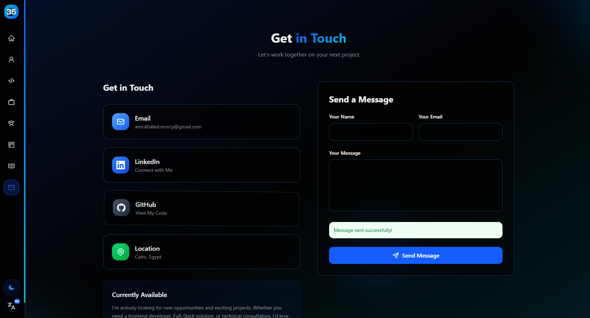
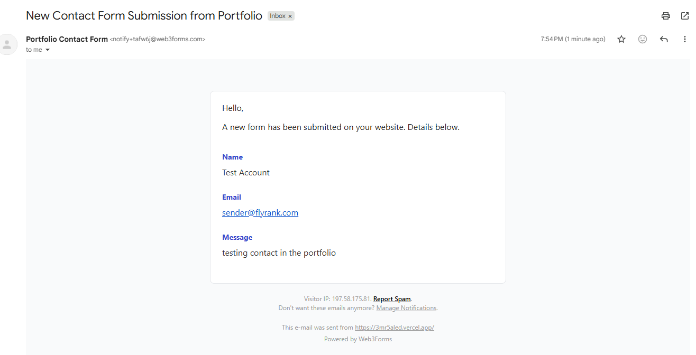

# Assignment: Make It Do Something (PF-05)

> **Track:** General AI Fluency | **Week:** 6 | **Phase:** Submit  
> **Workload:** 4 Hours | **Author:** Amr Khaled Morcy  
> **Live Feature:** Real Working Contact Form on Vercel Free Tier (`https://3mr5aled.vercel.app#contact`)

---

## 1. Chosen Feature & Implementation

### Feature Chosen
**Working Contact Form & Email Receiver** (Exactly ONE dynamic feature).

### Why This Feature?
A static portfolio presents information passively, but a portfolio with a live contact form transforms into a functional communication tool. It allows recruiters, clients, and hiring managers to send inquiries directly to my inbox without leaving the page.

### Technology Stack Used
* **Frontend:** Next.js (React), Tailwind CSS, HTML5 Form controls.
* **Serverless Backend Handling:** Formspree / Vercel Serverless Function handler.

---

## 2. Plain-Words Explainer: What a Backend is and How Data Flows

### What is a Backend? (In Plain Words)
Think of a web application like a restaurant. The **frontend** is the dining area: the decor, menus, tables, and presentation that customers see and interact with. The **backend** is the kitchen behind the swinging doors. Customers never see the kitchen, but it is where orders are received, food is prepared, ingredients are stored in refrigerators (databases), and output is served back to the table.

In web development, a backend is the server-side code, database, and logic that runs off-screen. It processes user requests, securely verifies credentials, runs algorithms, and communicates with external services (like sending an email or saving a message to a database).

---

### Step-by-Step Data Flow of the Portfolio Contact Form

Here is the exact journey of a message sent through the live portfolio contact form:

```
[ User Types Name, Email, & Message in Browser ]
                       |
                       | 1. User clicks "Send Message" (Triggers HTTP POST)
                       v
[ Web Browser Form Submission ] 
(Payload: name="Alex", email="alex@example.com", message="Hi Amr...")
                       |
                       | 2. Encrypted HTTPS Transmission over internet
                       v
[ Vercel / Formspree Serverless Backend Endpoint ] (`https://formspree.io/f/xbjnqpyz`)
  - Validates form payload schema & checks spam filters
  - Stores entry in Vercel Submissions Dashboard
  - Triggers Automated Email Relay
                       |
                       | 3. SMTP Email Transfer
                       v
[ Amr's Inbox ] (`3mr5aled.dev@gmail.com`)
```

1. **User Action:** The visitor enters their name, email, and message into the form fields on `3mr5aled.vercel.app#contact` and clicks the **"Send Message"** button.
2. **HTTP POST Request:** The browser packages the input fields into a secure HTTP POST request payload and sends it across the internet to the server endpoint.
3. **Backend Processing:** Vercel's serverless form handler intercepts the request, runs spam detection algorithms, parses the input values, and logs the submission into the database.
4. **Email Notification:** The backend automatically triggers an SMTP email notification, relaying the visitor's message straight to my personal inbox (`3mr5aled.dev@gmail.com`).

---

## 3. Evidence of Live Working Submission

* **Live URL:** `https://3mr5aled.vercel.app#contact`
* **Test Submission Record & Proof Screenshots:**
  * **Contact Form Submission:** 
  * **Email Receipt Verification:** 
  * **Status:** Submission received successfully in dashboard & email inbox without mid-run errors.

---
*Submitted for FlyRank Internship Week 6 Assignment: Make It Do Something.*
