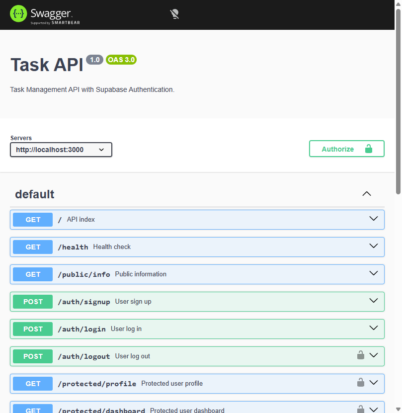

# Tasks CRUD API with Supabase Authentication & Prisma ORM

A professional, layered-architecture REST API built with Node.js, Express, Prisma ORM, and Supabase JWT Authentication.

---

## 🌟 Features

- **Layered Architecture:** Clear separation of concerns (Repository -> Service -> Routes -> Middleware).
- **Authentication & Security:** Supabase Auth integration supporting User Sign Up, Log In, and Log Out.
- **Reusable Auth Middleware:** Centralized `requireAuth` guard that verifies Supabase JWT bearer tokens.
- **Prisma ORM Database Access:** Clean database operations using Prisma ORM with SQLite database engine.
- **Interactive OpenAPI / Swagger Documentation:** Live interactive API docs with Bearer token authentication support at `/docs`.
- **Automated Testing Suite:** Native Node.js test runner suite (`npm test`).

---

## 🚀 Quick Start Guide

### 1. Prerequisites
- Node.js (v20+)
- npm

### 2. Environment Configuration
Copy `.env.example` to create your local `.env` file:

```bash
cp .env.example .env
```

Fill in your configuration details in `.env`:
```env
# Database Connection
DATABASE_URL="file:./prisma/tasks.db"

# Supabase Credentials
SUPABASE_URL=https://your-project.supabase.co
SUPABASE_PUBLISHABLE_KEY=your_publishable_key
SUPABASE_SECRET_KEY=your_secret_key
SUPABASE_JWKS_URL=https://your-project.supabase.co/auth/v1/.well-known/jwks.json

# Server Port
PORT=3000
```

### 3. Install Dependencies & Setup Database
```bash
npm install
npx prisma generate
npx prisma db push
```

### 4. Start the Application
Run the one command to start the server:

```bash
npm start
```
> The API will be live at `http://localhost:3000` and Swagger UI at `http://localhost:3000/docs`.

---

## 📚 API Endpoints Reference

| Method | Endpoint | Auth Required | Description |
| :--- | :--- | :--- | :--- |
| `GET` | `/` | ❌ Public | API index and metadata |
| `GET` | `/health` | ❌ Public | Service health check |
| `GET` | `/public/info` | ❌ Public | Public access test endpoint |
| `POST` | `/auth/signup` | ❌ Public | Register a new user (`email`, `password`) |
| `POST` | `/auth/login` | ❌ Public | Log in user & receive JWT access token |
| `POST` | `/auth/logout` | 🔒 Protected | Log out user (Requires `Bearer <token>`) |
| `GET` | `/protected/profile` | 🔒 Protected | Get user profile metadata (Requires `Bearer <token>`) |
| `GET` | `/protected/dashboard` | 🔒 Protected | Protected user dashboard (Requires `Bearer <token>`) |
| `GET` | `/tasks` | ❌ Public | List tasks (supports `?done=` and `?search=`) |
| `POST` | `/tasks` | ❌ Public | Create a new task |
| `GET` | `/tasks/:id` | ❌ Public | Get task by ID |
| `PUT` | `/tasks/:id` | ❌ Public | Update task by ID (`title`, `done`) |
| `DELETE` | `/tasks/:id` | ❌ Public | Delete task by ID |
| `GET` | `/stats` | ❌ Public | Get task counts (total, done, open) |
| `POST` | `/reset` | ❌ Public | Reset tasks to initial seed state |

---

## 🔒 Swagger UI & Authentication

Interactive Swagger UI is available at `http://localhost:3000/docs`. Click the **Authorize** button at the top right to input your `access_token` returned by `/auth/login` to test protected routes directly in your browser.



---

## 🧪 Running Integration Tests

Run the full integration test suite with:

```bash
npm test
```

---

## 📁 Repository Structure

```text
.
├── .env.example
├── .gitignore
├── openapi.json
├── package.json
├── prisma.config.ts
├── server.js
├── tasks.test.js
├── prisma/
│   └── schema.prisma
└── src/
    ├── app.js
    ├── error.js
    ├── db/
    │   └── index.js
    ├── middleware/
    │   ├── auth.middleware.js
    │   └── error-handler.js
    ├── repositories/
    │   ├── auth.repository.js
    │   └── tasks.repository.js
    ├── routes/
    │   ├── auth.routes.js
    │   ├── meta.routes.js
    │   └── tasks.routes.js
    └── services/
        ├── auth.services.js
        └── tasks.services.js
```
