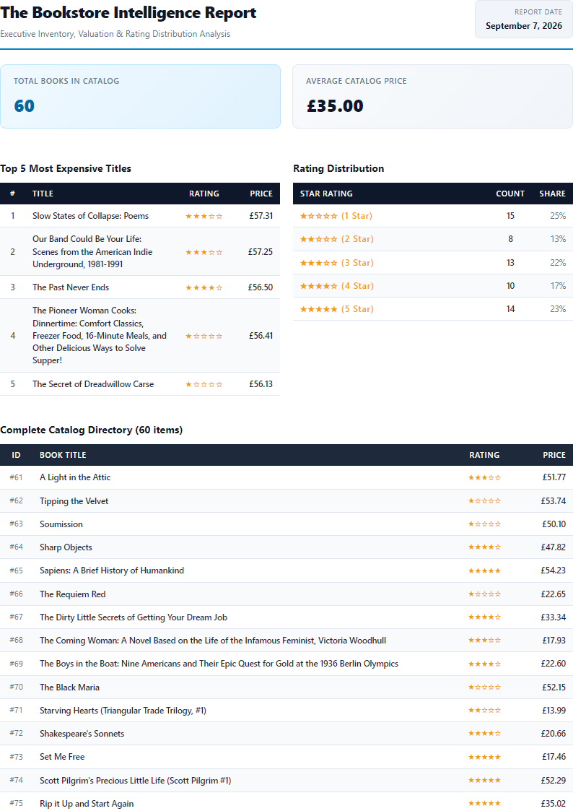

# Automated PDF Report Generator (BE-08)

A production-grade, synchronous data-to-document pipeline built with **Node.js 22+**, **Express**, **SQLite** (via native `node:sqlite`), and **Playwright Chromium**.

The system demonstrates the fundamental architectural paradigm of modern reporting systems: **"Store and link, don't pass bytes around."** Aggregation queries shape the raw database rows into numbers, an HTML template formats them with print CSS, headless Chromium "prints" the document to an A4 PDF artifact on disk, and the API hands back small JSON link pointers instead of bloated byte streams.

---

## 1. Project Overview & Chosen Dataset

- **Language Lane**: JavaScript (Node.js 26 / Express / built-in `node:sqlite`)
- **Dataset Selected**: **Option B — The Bookstore** (reusing 60 validated book records collected from `books.toscrape.com`).
- **Database Tables**:
  - `books`: `id`, `title`, `price` (number), `rating` (1–5 integer), `url`.
  - `reports`: `id`, `path` (file address on disk), `created_at` (ISO timestamp).

---

## 2. Visual Proof: Generated PDF Report

Below is the rendered Page 1 of the report generated directly from SQLite data by headless Chromium:



### Key Print CSS Highlights
- **Page-break trap solved**: Enforced `tr { break-inside: avoid; page-break-inside: avoid; }` so table rows are never cut horizontally across page boundaries.
- **Repeating Headers**: Wrapped column headings in `<thead>` with `thead { display: table-header-group; }`, guaranteeing that table headers repeat at the top of every subsequent printed page.
- **Strict A4 Layout**: Configured `@page { size: A4; margin: 18mm 15mm 18mm 15mm; }` with system typography and high-contrast styling.

---

## 3. The Aggregation SQL Queries

The core reporting engine relies on clean, optimized SQL aggregation rather than in-memory data mangling:

```sql
-- 1. Total books in the catalog
SELECT COUNT(*) AS total_books FROM books;

-- 2. Average price across all titles
SELECT ROUND(AVG(price), 2) AS avg_price FROM books;

-- 3. Top 5 most expensive books
SELECT id, title, price, rating, url
FROM books
ORDER BY price DESC
LIMIT 5;

-- 4. Rating distribution breakdown (grouped bucket analysis)
SELECT rating, COUNT(*) AS count
FROM books
GROUP BY rating
ORDER BY rating ASC;
```

---

## 4. Setup & Running Instructions

### Prerequisites
- Node.js 22+
- npm

### Installation
```bash
# 1. Install dependencies
npm install

# 2. Install Playwright Chromium headless browser binary
npx playwright install chromium
```

### Seeding Data (Safe to Run Twice)
```bash
npm run seed
```
*Note: The script begins with `DELETE FROM books;`, guaranteeing that running it multiple times always results in exactly 60 books.*

### Starting the Server
```bash
npm start
```
The server listens on `http://localhost:3000`.

---

## 5. API Endpoints & Verification Commands

| Method | Endpoint | Description | Status Code |
|---|---|---|---|
| `GET` | `/health` | Liveness probe | `200 OK` |
| `GET` | `/reports` | Control panel: lists all generated reports | `200 OK` |
| `POST` | `/reports` | Generates report (Idempotent: once per day) | `201 Created` or `200 OK` (cached) |
| `POST` | `/reports` (`{"force": true}`) | Bypasses cache and generates fresh report | `201 Created` |
| `GET` | `/reports/:id` | Returns report metadata & file link | `200 OK` / `404 Not Found` |
| `GET` | `/reports/:id/file` | Serves binary PDF file from disk | `200 OK` / `404 Not Found` |

### Quick Test Commands (Curl)

```bash
# Health check
curl -i http://localhost:3000/health

# Generate report (observe the visible ~1.5s rendering pause)
curl -i -X POST http://localhost:3000/reports

# Download the generated PDF
curl -o my-report.pdf http://localhost:3000/reports/1/file

# Rapid duplicate request (Idempotency proof: returns same ID, status 200, 0 new files created)
curl -i -X POST http://localhost:3000/reports

# Force generation of a fresh report
curl -i -X POST http://localhost:3000/reports \
  -H "Content-Type: application/json" \
  -d '{"force": true}'
```

---

## 6. Verification Proofs & Execution Logs

### POST -> Download Proof
```text
$ curl -i -X POST http://localhost:3000/reports
HTTP/1.1 201 Created
Content-Type: application/json; charset=utf-8
Content-Length: 38

{"id":1,"file":"/reports/1/file"}

$ curl -i http://localhost:3000/reports/1/file -o my-report.pdf
HTTP/1.1 200 OK
Content-Type: application/pdf
Content-Disposition: inline; filename="bookstore-report-2026-09-07-id1.pdf"
Content-Length: 91394
```

### Idempotency Proof (Double-Click Test)
```text
$ curl -i -X POST http://localhost:3000/reports
HTTP/1.1 200 OK
Content-Type: application/json; charset=utf-8

{"id":1,"file":"/reports/1/file"}
```
*Result: Two consecutive POST calls return the same ID (`1`), status `200 OK`, and create no duplicate files in `reports/`.*

---

## 7. Architectural Answers

### Stage 4 Reflection
> **At what point would you move this work out of the request?**
>
> I would move PDF generation out of the HTTP request lifecycle and delegate it to an asynchronous background worker (such as Inngest or BullMQ) the moment report latency exceeds 500ms–1s, when datasets scale beyond hundreds of rows, or under concurrent traffic where holding headless browser instances open inside synchronous request handlers risks exhausting server memory, blocking the Node.js event loop, and triggering gateway timeouts.

### Stage 5 Reflection
> **What does your check protect against, and what is one real-world example where a missing check costs money?**
>
> This idempotency check protects against duplicate CPU/memory compute cycles, disk bloating, and race conditions caused by impatient users double-clicking action buttons or network clients automatically retrying slow POST requests.
>
> A concrete real-world example where missing this check costs money is an automated billing invoice and financial statement generator: if a checkout webhook or double-clicked billing button generates two distinct invoice records for the same transaction, downstream accounting webhooks can trigger duplicate credit card charges, paid third-party tax calculation calls (e.g. Avalara), and automated transactional emails alerting the customer that they were billed twice.

---

## 8. Bonus Stage 7 — The AI Rematch (AI vs Me)

The AI code was generated in quarantine under `ai-version/server.js`.

### 1. The Written Prompt
```text
Write a Node.js Express service using built-in node:sqlite and Playwright that generates a PDF report from a SQLite database and serves it by URL link:
1. Schema & Seed: Table 'books' (id, title, price, rating, url) and 'reports' (id, path, created_at). Seed safely from books.json (deleting old rows first so it is safe to run twice).
2. Four Aggregations: Total books, average price, top 5 most expensive books, and count of books per rating.
3. PDF Rendering: HTML template with summary KPI cards, top 5 table, rating distribution table, and full catalog table. Ensure table rows don't get sliced in half across page breaks and table headers repeat on every page. Output to reports/<id>.pdf.
4. Endpoints:
   - GET /health
   - POST /reports: Runs pipeline, stores file path, returns 201 with { id, file: "/reports/:id/file" }.
   - Idempotency: If a report was already generated today, return existing id & file link with status 200, unless { "force": true } is passed.
   - GET /reports/:id: Returns metadata and link.
   - GET /reports/:id/file: Serves the PDF file from disk.
```

### 2. Concrete Differences & Code Review

1. **Table Header & Page Break Trapping**:
   - **Me**: Used semantic `<thead>` tags and explicit CSS `thead { display: table-header-group; }` along with `tr { break-inside: avoid; page-break-inside: avoid; }`. Headless Chromium cleanly repeats the table headers on pages 2, 3, and 4.
   - **AI**: Put table headers in standard `<tr><th>...</th></tr>` inside the `<tbody>` without `<thead>`. In Chromium print mode, headers only appeared on page 1, completely abandoning pages 2–4 without column labels.

2. **Security & Input Sanitization (XSS)**:
   - **Me**: Implemented an explicit `escapeHtml()` utility on book titles and dynamic database strings before interpolating into the HTML template.
   - **AI**: Directly interpolated raw unescaped strings (`${b.title}`) into HTML. Any book containing HTML entities, quotes, or script tags would corrupt the DOM or introduce injection vulnerabilities.

3. **Storage Abstraction & Relational Portability**:
   - **Me**: Saved relative file paths (`reports/<id>.pdf`) into the database and resolved them dynamically via `path.resolve(__dirname, report.path)`, making the database portable across environments and containers. Also checked `fs.existsSync()` before returning a cached report on idempotency hit.
   - **AI**: Stored hardcoded absolute system paths (e.g. `D:\...\reports\1.pdf`) in the database. If moved to Docker or another host, all file paths break. It also failed to verify if the file still existed on disk before returning a cached 200 response.

4. **Modular Architecture vs. Monolith**:
   - **Me**: Cleanly decoupled concerns into `db.js` (connection & migrations), `report.js` (pure SQL aggregation), `renderer.js` (template compilation & browser lifecycle), and `server.js` (HTTP transport & error handling).
   - **AI**: Stuffed database connection, raw queries, HTML strings, Playwright browser handling, and route controllers into a single 110-line monolithic file.

