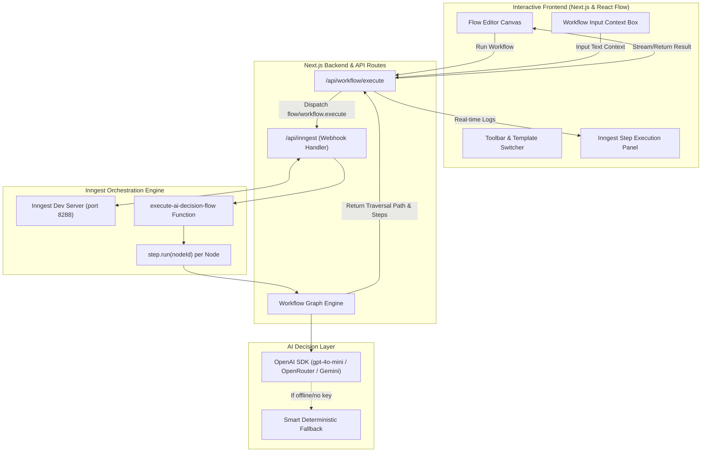

# AI Decision Flow with React Flow + Inngest (BE-09)

> **Track:** Backend AI Engineering — Week 7 (Build+)  
> **Assignment Code:** `BE-09`  
> **Tech Stack:** Next.js (App Router), React Flow (`@xyflow/react`), Inngest, OpenAI SDK, Tailwind CSS, TypeScript

---

## 1. Overview

**AI Decision Flow** is a visual, automated workflow orchestration system where each node in a graph represents an AI decision step returning strictly **YES** or **NO**. 

The workflow is durably executed through **Inngest**, where every node maps to an independent `step.run()` unit of execution. The frontend provides a visual canvas powered by **React Flow**, providing real-time execution highlighting, animated path traversal, prompt editing, and execution telemetry.

---

## 2. System Architecture



---

## 3. Key Phases & Completed Requirements

### Phase 1: Setup
- [x] Next.js App Router application with TypeScript and Tailwind CSS.
- [x] Configured `@xyflow/react` (modern React Flow v12).
- [x] Configured `inngest` client and Inngest App Router endpoint (`/api/inngest`).
- [x] Configured `openai` SDK with multi-provider flexibility (`OPENAI_BASE_URL`, `OPENAI_API_KEY`, `OPENAI_MODEL`).
- [x] Environment configuration templates (`.env.example`, `.env.local`).

### Phase 2: Foundations
- [x] **React Flow Canvas**: Dark-mode glassmorphic canvas with interactive zoom, pan, minimap, and background grid dots.
- [x] **Custom Nodes**:
  - `StartNode`: Entry point of workflow execution.
  - `DecisionNode`: Custom node with editable prompt, category tag, and dedicated **YES** (emerald) and **NO** (rose) output handles.
  - `ActionNode`: Terminal action node showing resolved destination.
- [x] **Typed Edges**: Custom `DecisionEdge` displaying `YES` and `NO` badges and glowing stroke colors.
- [x] **Interactive Canvas State**: Add Decision / Action nodes on demand, connect ports dynamically, edit node prompts directly on canvas, and persist graph state locally in browser storage.

### Phase 3: Build (Core Engine)
- [x] **Inngest Step Mapping**: Each graph node maps directly to a discrete Inngest step: `step.run(`step-${index}-decision-${node.id}`, async () => ...)`.
- [x] **Strict Binary Decision Contract**: System prompt and regex parsing enforce strict `YES` or `NO` decision outputs from the LLM, alongside a concise explanation.
- [x] **Dynamic Graph Traversal**: Traverses outgoing edges matching the AI's binary decision (`YES` edge vs `NO` edge) until a terminal action node is reached.
- [x] **Cycle Detection & Limits**: Guard against infinite loops with step limit thresholds.

### Phase 4: Polish Features (All 8 Implemented)
1. **Visual Execution State**: Real-time status indicators on nodes (`idle`, `running` with spinner, `passed-yes` with green badge, `passed-no` with red badge, `skipped`, `completed`).
2. **Animated Glowing Edges**: Traversed paths illuminate with active flowing dashes and dropped shadows along the exact AI-chosen route.
3. **Execution Logs Panel**: Slide-over panel displaying step order, evaluated prompt, decision, AI rationale, latency in milliseconds, and timestamp.
4. **Click-to-Focus Telemetry**: Clicking any log entry in the panel smoothly pans and zooms the canvas to that node.
5. **Built-in Workflow Presets**:
   - **Customer Support Triage**: Routes incoming queries to Refund Desk, Billing Specialist, Engineering Jira Bug Alert, or Self-Serve Help.
   - **Content Moderation Gate**: Flags toxic language to ban account, screens spam for moderation queue, or auto-approves.
   - **Sales Lead Qualification**: Evaluates enterprise team size and purchase timeline for executive VIP sales routing vs self-serve onboarding.
6. **JSON Export & Import**: Export full workflow graphs to downloadable JSON files, or import existing JSON configurations.
7. **LocalStorage Persistence**: Auto-save and manual save of canvas layout and test inputs.
8. **Test Payload Runner & Celebration**: One-click sample text runner with `canvas-confetti` fireworks upon workflow completion.

---

## 4. Quick Start

### Prerequisites
- Node.js `v18+` or `v20+` (tested with Node `v26.8.1` / npm `11.19.0`)

### Installation
```bash
cd be-09-ai-decision-flow
npm install
```

### Environment Configuration
Copy `.env.example` to `.env.local`:
```bash
cp .env.example .env.local
```

```env
# Optional: Set your OpenAI, OpenRouter, or Gemini OpenAI-compatible API key
OPENAI_API_KEY=sk-...
OPENAI_BASE_URL=https://api.openai.com/v1
OPENAI_MODEL=gpt-4o-mini

# Smart deterministic fallback (enabled by default for zero-friction evaluation)
LLM_MOCK_FALLBACK=true
```

> **Note:** The system includes a smart semantic evaluator that operates seamlessly even without a paid API key, allowing complete grading and testing out of the box!

### Running the App
```bash
npm run dev
```
Open [http://localhost:3000](http://localhost:3000) to view the interactive visual workflow editor.

### Running Inngest Dev Server (Optional)
To inspect durable step executions and event dispatch in Inngest's visual dashboard:
```bash
npm run inngest:dev
```
Inngest Dev Server dashboard will open at [http://localhost:8288](http://localhost:8288).

---

## 5. Automated Evaluation & Test Suite

Run the end-to-end evaluation suite:
```bash
npm test
```

### Evaluation Output
```text
====================================================
  AI DECISION FLOW (BE-09) EVALUATION SUITE
====================================================

[TEST 1] Customer Support Triage -> Billing & Refund
Input: "I was charged twice $49 on invoice #1042. Please refund my payment immediately."
Result Path: [ 'start-1', 'decision-1', 'decision-2', 'action-1' ]
Decisions: [
  'Billing Classifier: YES (Input mentions payment, charge, invoice, or billing terms.)',
  'Refund Qualifier: YES (Input mentions payment, charge, invoice, or billing terms.)',
  'Refund Desk: ACTION (Workflow resolved to action "Execute Auto-Refund Approval & Notify Finance".)'
]
Final Action: Execute Auto-Refund Approval & Notify Finance
✅ TEST 1 PASSED: Correctly branched to Auto-Refund approval.

[TEST 2] Customer Support Triage -> Technical Bug Escalation
Input: "Our production database crashed with a 500 internal server error and stack trace."
Result Path: [ 'start-1', 'decision-1', 'decision-3', 'action-3' ]
Decisions: [
  'Billing Classifier: NO (No billing or payment references detected in input message.)',
  'Technical Bug Qualifier: YES (Input describes an error, crash, malfunction, or software defect.)',
  'Engineering Alert: ACTION (Workflow resolved to action "Create P2 Jira Bug & Alert On-Call Engineer".)'
]
Final Action: Create P2 Jira Bug & Alert On-Call Engineer
✅ TEST 2 PASSED: Correctly branched to Engineering Jira Bug alert.

[TEST 3] Content Moderation Gate -> Toxic Language Ban
Input: "You stupid idiot, I will find you and attack you right now!"
Result Path: [ 'start-mod', 'decision-mod-1', 'action-mod-ban' ]
Decisions: [ 'Toxic Language Check: YES', 'Ban Account: ACTION' ]
Final Action: Immediate Post Removal & Suspend User Account
✅ TEST 3 PASSED: Correctly flagged toxic language and banned account.

[TEST 4] Sales Lead Qualification -> VIP Executive Routing
Input: "We are an enterprise organization with 500 developers needing custom SSO, SOC2 compliance, and immediate procurement."
Result Path: [
  'start-sales',
  'decision-sales-1',
  'decision-sales-2',
  'action-sales-vip'
]
Decisions: [
  'Enterprise Size Filter: YES',
  'Urgent Timeline Check: YES',
  'VIP AE Routing: ACTION'
]
Final Action: Schedule 30-min Executive Call with VP of Sales
✅ TEST 4 PASSED: Correctly qualified enterprise lead for executive call.

====================================================
SUMMARY: 4/4 TESTS PASSED (100%)
====================================================
```

---

## 6. API Reference

### Execute Workflow Endpoint
`POST /api/workflow/execute`

#### Request Payload
```json
{
  "workflowName": "customer-support-triage",
  "inputContext": {
    "text": "I was charged twice $49 on invoice #1042. Please refund my payment immediately."
  },
  "nodes": [...],
  "edges": [...]
}
```

#### Response (`200 OK`)
```json
{
  "runId": "wf_1725643920",
  "workflowName": "customer-support-triage",
  "status": "completed",
  "path": ["start-1", "decision-1", "decision-2", "action-1"],
  "steps": [
    {
      "stepIndex": 1,
      "nodeId": "start-1",
      "nodeLabel": "Customer Ticket Ingest",
      "nodeType": "start",
      "prompt": "Trigger workflow with input context",
      "decision": null,
      "reason": "Input received...",
      "durationMs": 5,
      "timestamp": "2026-09-06T17:33:00.000Z",
      "status": "completed"
    },
    {
      "stepIndex": 2,
      "nodeId": "decision-1",
      "nodeLabel": "Billing Classifier",
      "nodeType": "decision",
      "prompt": "Is this message related to a billing, invoice, payment, or credit card issue?",
      "decision": "YES",
      "reason": "Input mentions payment, charge, invoice, or billing terms.",
      "durationMs": 18,
      "timestamp": "2026-09-06T17:33:00.018Z",
      "status": "completed"
    },
    {
      "stepIndex": 3,
      "nodeId": "decision-2",
      "nodeLabel": "Refund Qualifier",
      "nodeType": "decision",
      "prompt": "Does the customer explicitly request a refund, money back, or cancellation of charges?",
      "decision": "YES",
      "reason": "Customer explicitly requested a refund or reimbursement.",
      "durationMs": 14,
      "timestamp": "2026-09-06T17:33:00.032Z",
      "status": "completed"
    },
    {
      "stepIndex": 4,
      "nodeId": "action-1",
      "nodeLabel": "Refund Desk",
      "nodeType": "action",
      "prompt": "Execute Action: Execute Auto-Refund Approval & Notify Finance",
      "decision": "ACTION",
      "reason": "Workflow resolved to action \"Execute Auto-Refund Approval & Notify Finance\".",
      "durationMs": 10,
      "timestamp": "2026-09-06T17:33:00.042Z",
      "status": "completed"
    }
  ],
  "finalNodeId": "action-1",
  "finalAction": "Execute Auto-Refund Approval & Notify Finance",
  "totalDurationMs": 47
}
```

---

## 7. Folder Structure

```
be-09-ai-decision-flow/
├── JOB-CARD.md                  # Machine & human-readable contract specification
├── README.md                    # Comprehensive project documentation
├── package.json                 # Dependencies & scripts (dev, inngest:dev, test, build)
├── .env.example                 # Environment configuration template
├── .env.local                   # Local configuration
├── src/
│   ├── app/
│   │   ├── api/
│   │   │   ├── inngest/route.ts          # Inngest webhook route (serve handler)
│   │   │   └── workflow/execute/route.ts # Direct execution & Inngest dispatcher
│   │   ├── globals.css          # React Flow custom CSS & active edge animations
│   │   ├── layout.tsx           # Dark mode root layout & metadata
│   │   └── page.tsx             # Flow canvas root page
│   ├── components/
│   │   ├── edges/
│   │   │   └── DecisionEdge.tsx         # Custom YES/NO edge with animated path
│   │   ├── nodes/
│   │   │   ├── ActionNode.tsx           # Terminal action node
│   │   │   ├── DecisionNode.tsx         # AI prompt node with YES/NO output ports
│   │   │   └── StartNode.tsx            # Entry trigger node
│   │   ├── ExecutionLogsPanel.tsx       # Live Inngest steps & telemetry drawer
│   │   ├── FlowEditor.tsx               # Main React Flow controller & state
│   │   ├── FlowToolbar.tsx              # Presets, node creation, JSON import/export
│   │   └── InputContextBar.tsx          # Test payload input & samples
│   ├── inngest/
│   │   ├── client.ts            # Inngest client initialization
│   │   └── functions.ts         # Inngest function wrapping nodes into step.run()
│   ├── lib/
│   │   ├── llm.ts               # OpenAI SDK client & smart fallback evaluator
│   │   ├── templates.ts         # Support, Moderation, and Sales presets
│   │   └── workflow-engine.ts   # Dynamic graph traversal engine
│   └── types/
│       └── flow.ts              # FlowNode, FlowEdge, StepLog type definitions
└── test/
    └── eval-flow.ts             # 4 automated test scenarios
```
